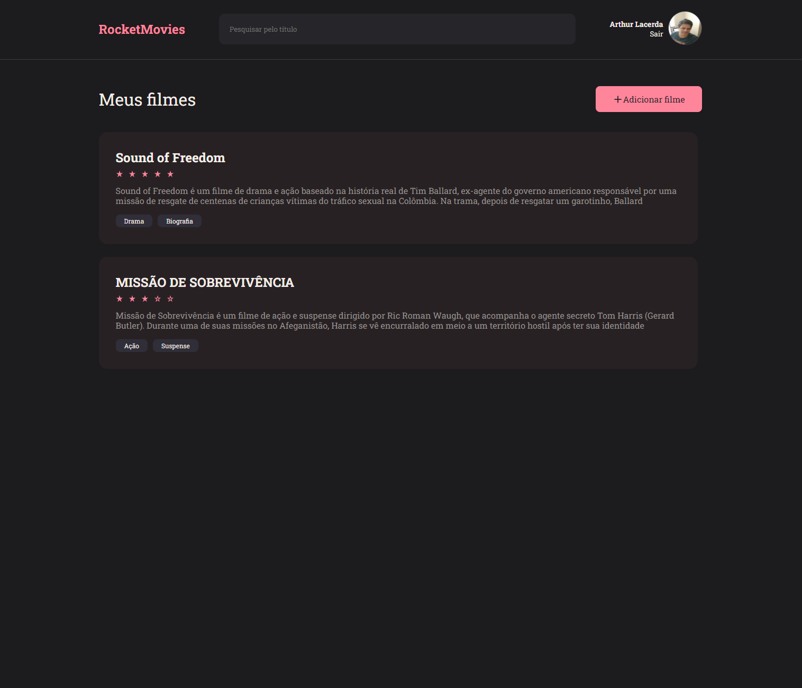
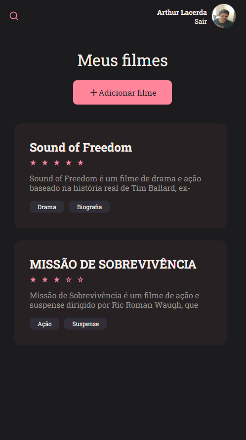

# Rocketmovies Frontend

This project is the api and visual part of an application to save, show, edit and delete movies from a database.

## Preview

<h1 align="center">
    
</h1>

<h1 align="center">
    
</h1>

</br>

## About

This is one of the proposed projects in the [Rocketseat Explorer](https://www.rocketseat.com.br/explorer) program, the [details are here](https://efficient-sloth-d85.notion.site/ Front-end-da-aplica-o-30a5132b30534255b238a8aa1b48c963), this application is the frontend of a system that registers users, and allows these users to register, view, edit and delete movie annotations in a RESTful API.

</br>

## Technologies

- **ReactJS** - used to build interfaces;
- **JS** - used to do all the application logic;
- **Styled Components** - used for styling;
- **Git** - responsible for performing code versioning.
- **Axios** - used to make requests.
- **Vite** - used to create a React project;
- **NPM** - used to install dependencies;

## Use

- Start by cloning the project:

```bash
  $ git clone [https://github.com/](https://github.com/arks-lacerda/client-movies.git)
```

- Enter the directory:

```bash
  $ cd client-movies
```

- Install the dependencies:

```bash
  $ npm install
```

- Start a local server:

```bash
  $ npm run dev
```

## 📝 License

This project is under the [MIT]() license. See the LICENSE file for more details.

</div>
<div id="MyLinkedIn">

## 🔎 My LinkedIn

<a href="https://www.linkedin.com/in/arks-lacerda/"></a>

<h3 align="center">Developed by Arthur Lacerda ☕</h3>
</d
